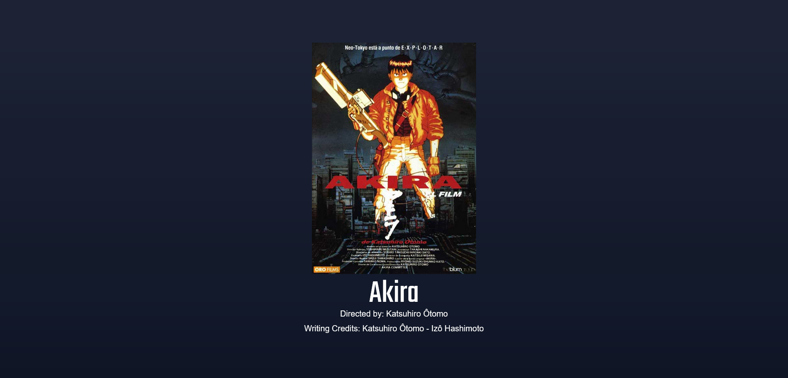

# Desafío 2 - Condiciones y Operadores Lógicos 🚀 

¡Hola de nuevo! 👋 

En este desafío, nos enfrentamos a la validación de conocimientos sobre la manipulación del DOM y el uso de instrucciones `if`, `else if`, `else` y operadores lógicos. Resolvamos juntos los tres problemas propuestos.

## Problema 1 - Borde a una Imagen 📷 

Para este desafío, construí una página con una única imagen. Al hacer clic en la imagen, se agrega un borde rojo de 2 píxeles. Si vuelves a hacer clic, ¡el borde desaparece!



### Código Destacado 🧩

```javascript
flyer = document.querySelector('.flyer');

document.querySelector('.flyer').addEventListener('click', function () {
    if (flyer.style.border === "") {
        flyer.style.border = "2px solid red";
    } else if (flyer.style.border === "2px solid red") {
        flyer.style.removeProperty("border");
    }
});
```

## Problema 2 - Pedido de Stickers 🎨 

En este desafío, construí una página web que permite pedir hasta 10 stickers de tres tipos diferentes. Cada tipo tiene su propio campo de entrada para que el usuario ingrese la cantidad deseada. Luego, se muestra un mensaje indicando la cantidad total de stickers llevados o si se llevan demasiados.


### Código Destacado 🧩

```javascript
document.querySelector('button').addEventListener('click', function () {
    value1 = Number(document.querySelector('.input1').value)
    value2 = Number(document.querySelector('.input2').value)
    value3 = Number(document.querySelector('.input3').value)

    if (value1 < 0) {
        value1 = 0;
    }

    if (value2 < 0) {
        value2 = 0;
    }

    if (value3 < 0) {
        value3 = 0;
    }

    total = value1 + value2 + value3;

    textStickers = document.querySelector('.text');
    if (total <= 10) {
        textStickers.innerText = `Llevas ${total} stickers`
    } else {
        textStickers.innerText = `Llevas demasiados stickers`
    }
});
```

## Problema 3 - Verificación de Password 🔒 

En este último desafío, creé una página con tres selectores y opciones numéricas del 1 al 9. Al hacer clic en el botón "Ingresar", se verifica el password. Si es 911, se muestra "Password 1 correcto"; si es 714, se muestra "Password 2 correcto"; de lo contrario, se muestra "Password incorrecto".

### Código Destacado 🧩


```javascript
document.querySelector('button').addEventListener('click', function () {
    value1 = Number(document.querySelector('#select1').value)
    value2 = Number(document.querySelector('#select2').value)
    value3 = Number(document.querySelector('#select3').value)
    textPassword = document.querySelector('p');

    if (value1 === 9 && value2 === 9 && value3 === 1) {
        textPassword.innerText = `Password 1 correcto`
    } else if (value1 === 7 && value2 === 1 && value3 === 4) {
        textPassword.innerText = `Password 2 correcto`
    } else {
        textPassword.innerText = `Password incorrecto`
    }
});

```